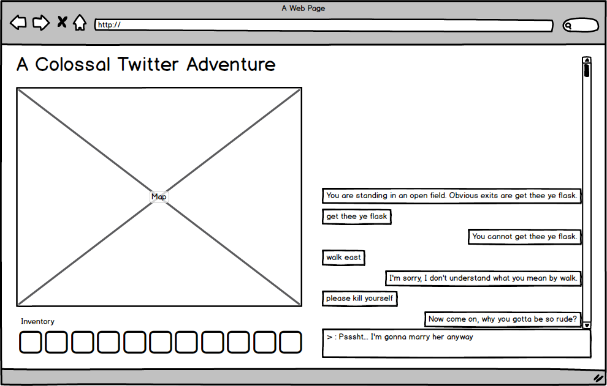

# A Colossal Twitter Adventure

[Click here to play this game online!](https://wscottsh.github.io/twitter-text-adventure/)

## Description

__A Colossal Twitter Adventure__ is a game engine for building text adventure games that are played on the Twitter platform. The player tweets their instructions to a twitter bot, and the twitter bot responds with the proper description of the room the player is currently located.

All logic for the MVP will be run on a hosted website without any server side implementation or API integration. For the MVP, I'm focusing on the visual representation and internal room object structuring, then will expand to implement additional features in the future.

In future iterations, I would like to expand the functionality to use the Twitter API as the user/game interface tool. This will allow the game to be played anywhere twitter is available, including:
- On phones
- Within the twitter's browser interface
- Embedded in a third-party webpage or tool
- SMS
- etc...

In even further iterations, I'd like to expand it to include the ability to allow user-created text adventure campaigns to be uploaded to a single persistent database that would operate as a Twitter powered MMO text adventure. Akin to the concept of early Multi-User Dungeon games, this would allow for many players to navigate through a single shared space and potentially interact with one another.

Taking advantage of the Twitter infrastructure could allow users to share or embed their personal adventures anywhere they please. Additionally, the open nature of Twitter will increase exposure of the app to the player's Twitter followers. The social implications of this kind of real-time open text adventure style gameplay on Twitter is amusing to consider.

### [Original Twitter Text Adventure Scribbles on Evernote](https://www.evernote.com/shard/s23/sh/66d95a0b-6a96-445a-b115-b7ddd46d113f/0448409f567394fdff292976fde3726b)

# User Persona

## Jeff

- 31 years old
- Works in call support at a video game company
- Digital and physical media Artist
- Served in the US Airforce
- Lives in Austin, TX

### Goals

- Wants to move from working dead end jobs to having a successful career as an artist
- Wouldn't mind having a job in the game industry somewhere

### Motivations

- Wants to make sure that he can live the principles he cares about.
- Motivated by being real.
- Likes meeting people and talking deep about things that matter to him.

### Likes

- Video games, especially weird, nostalgic, or ones with good stories
- Drawing
- Reading deep/weird books
- Yummy food
- Table top gaming

### Dislikes

- Being called out
- Forced to adopt a culture that he doesn't want to be part of

## Hector

- 35 years old
- Works at a software development company as a developer
- Lives in Seattle, WA
- Rides to and from work on the Rail

### Goals

- Wants to make games for a living, but doesn't really want to deal with the industry shenanigans
- Wants to play video games more, but doesn't have time between work and family life

### Motivations

- Dives deep into game design and development practices in his spare time
- Motivated by a good story
- Has a need to create, write, and collaborate with others

### Likes

- Video games
- Writing
- Going out to grab a drink after work
- Playing games on his phone on the train

### Dislikes

- Doing the same thing over and over
- Taking social media too seriously
- Gross sushi

## User Stories for MVP

1. As a player, I want to dive into some nostalgic gaming to 'member the good ol' days when videogames were better.
1. As a husband that rides the train to and from work, I want to fit gaming into the cracks so I can participate in my favorite passtime without sacrificing family time.
1. As a player, I want to have a map and inventory displayed on my screen so I can take text adventuring on the go without needing to carry a drawn map.

## User Stories for Future Iterations

1. As a player, I want to play through Zork on Twitter to have a reason to use my Twitter account.
1. As a player, I want to share my gaming with the world so I can connect with others that share a similar hobby.
1. As a level creator, I want to create my own rooms and host them online within the persistent world so I can make the world massive and personalized.

## MVP

1. Recreate Zork in JS, then deliver that experience in a browser.
  - Build input parser
  - Build a series of room objects with viable accepted commands, descriptions, and items.
  - Accept input via browser, to which database responds with correct description and viable directions
2. Display inventory of collected items in bottom left.
3. Auto update and populate the map based on rooms you've visited.
  - Hover over each room to re-display the room description via a pop-up in the UI (not using the Alt Text)
  - Visualization of the directions it's possible to move based on pulling object information from database

### Ways to build further after MVP

2. Hook it up to the twitter API and embed those tweets into the HTML page.
  - Tweet commands to a twitter bot, which responds back with room descriptions via tweet.
3. Add functionality for users to create their own campaigns using a submission form.
5. Build MMO side
  - Add combat system
  - Add interacting with other players
  - Add real-time elements on timers

I originally scribbled some ideas for this game in 2012, but didn't have the skills to implement it at the time. Feel free to dig through the few pages of jotted notes to get a feel for the original idea here:

### [Twitter Text Adventure on Evernote](https://www.evernote.com/shard/s23/sh/66d95a0b-6a96-445a-b115-b7ddd46d113f/0448409f567394fdff292976fde3726b)

